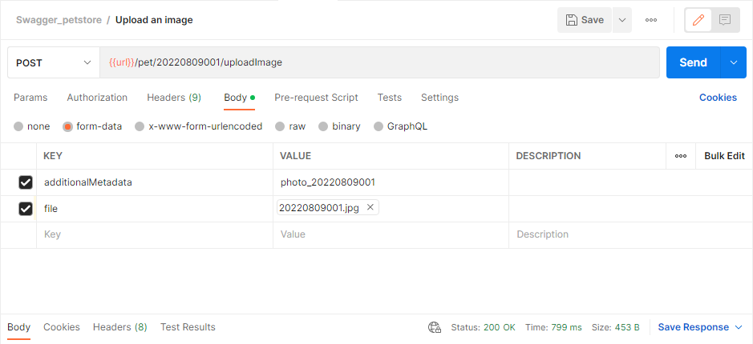

# API Testing 

## Table of Contents

- [About](#about)
- [Swagger](#swagger)
- [Postman](#postman)

## About 

**Executing API requests**  

• Executing API requests by Swagger (<https://petstore.swagger.io>)  
• Executing API requests by Postman, creating collections, variables, and tests

## Swagger 

This task was performed at   

<small>

• [Request #1 - Add_a_new_pet_to_the_store](#s1)  
• [Request #2 - Delete_a_pet](#s2)  
• [Request #3 - Delete_purchase_order_by_ID](#s3)  
• [Request #4 - Find_pet_by_ID](#s4)  
• [Request #5 - Find_pets_by_status](#s5)  
• [Request #6 - Find_purchase_order_by_ID](#s6)  
• [Request #7 - Place_an_order_for_a_pet](#s7)  
• [Request #8 - Return_pet_inventories_by_status](#s8)  
• [Request #9 - Update_a_pet_in_the_store_with_form_data](#s9)  
• [Request #10 - Update_an_existing_pet](#s10)  
• [Request #11 - Upload_an_image](#s11)  

</small>

  
<small>[Go back](#swagger)</small>

  
<small>[Go back](#swagger)</small>

  
<small>[Go back](#swagger)</small>

  
<small>[Go back](#swagger)</small>

  
<small>[Go back](#swagger)</small>

  
<small>[Go back](#swagger)</small>

  
<small>[Go back](#swagger)</small>

  
<small>[Go back](#swagger)</small>

  
<small>[Go back](#swagger)</small>

  
<small>[Go back](#swagger)</small>

[Go back](#start)

## Postman 

This task was performed by using API [Swagger Petstore](https://petstore.swagger.io).  

<small>

• [Created collection](#p_collection_)  
• [Collection's run results](#p_results)  
• [Request #1 - Add_a_new_pet_to_the_store](#p1)  
• [Request #2 - Delete_a_pet](#p2)  
• [Request #3 - Delete_purchase_order_by_ID](#p3)  
• [Request #4 - Find_pet_by_ID](#p4)  
• [Request #5 - Find_pets_by_status](#p5)  
• [Request #6 - Find_purchase_order_by_ID](#p6)  
• [Request #7 - Place_an_order_for_a_pet](#p7)  
• [Request #8 - Return_pet_inventories_by_status](#p8)  
• [Request #9 - Update_a_pet_in_the_store_with_form_data](#p9)  
• [Request #10 - Update_an_existing_pet](#p10)  
• [Request #11 - Upload_an_image](#p11)  

</small>

 In Postman was created a collection  
  
<small>[Go back](#postman)</small>

 Results of executing all the requests:  
  
<small>[Go back](#postman)</small>

  
<small>[Go back](#postman)</small>

  
<small>[Go back](#postman)</small>

  
<small>[Go back](#postman)</small>

  
<small>[Go back](#postman)</small>

  
<small>[Go back](#postman)</small>

  
<small>[Go back](#postman)</small>

  
<small>[Go back](#postman)</small>

  
<small>[Go back](#postman)</small>

  
<small>[Go back](#postman)</small>

  
<small>[Go back](#postman)</small>

  

[Go back](#start)