# API Testing 

## Table of Contents

- [About](#about)
- [Swagger](#swagger)
- [Postman](#postman)
- [JMeter](#jmeter)

## About 

**Executing API requests**  

• Executing API requests by ***Swagger*** (<https://petstore.swagger.io>)  
• Executing API requests by ***Postman***, creating collections, variables, and tests  
• Executing API requests by ***JMeter***, execution of load tests   

## Swagger 

This task was performed at   

<small>

• [Request #1 - Add a new pet to the store](#s1)  
• [Request #2 - Find pet by ID](#s2)  
• [Request #3 - Update an existing pet](#s3)  
• [Request #4 - Find pets by status](#s4)  
• [Request #5 - Update a pet in the store with form data](#s5)  
• [Request #6 - Upload an image](#s6)  
• [Request #7 - Delete a pet](#s7)  
• [Request #8 - Place an order for a pet](#s8)  
• [Request #9 - Find purchase order by ID](#s9)  
• [Request #10 - Return pet inventories by status](#s10)  
• [Request #11 - Delete purchase order by ID](#s11)  

</small>

 Request #1 - Add a new pet to the store  
  
<small>[🔙 Go back](#swagger)</small>

 Request #2 - Find pet by ID  
  
<small>[🔙 Go back](#swagger)</small>

 Request #3 - Update an existing pet  
  
<small>[🔙 Go back](#swagger)</small>

 Request #4 - Find pets by status  
  
<small>[🔙 Go back](#swagger)</small>

 Request #5 - Update a pet in the store with form data  
  
<small>[🔙 Go back](#swagger)</small>

 Request #6 - Upload an image  
  
<small>[🔙 Go back](#swagger)</small>

 Request #7 - Delete a pet  
  
<small>[🔙 Go back](#swagger)</small>

 Request #8 - Place an order for a pet  
  
<small>[🔙 Go back](#swagger)</small>

 Request #9 - Find purchase order by ID  
  
<small>[🔙 Go back](#swagger)</small>

 Request #10 - Return pet inventories by status  
  
<small>[🔙 Go back](#swagger)</small>

 Request #11 - Delete purchase order by ID  
  

[⬆️ Go to top](#start)

---

## Postman 

This task was performed by using API [Swagger Petstore](https://petstore.swagger.io).  
All the requests use a variable `url = https://petstore.swagger.io/v2`.  
Postman collection is present [in this repository](./Postman/Swagger_petstore.postman_collection.json). 
Or [JSON link](https://www.getpostman.com/collections/5e440ad7a638341a533a) to this collection.  
[Test results](./Postman/Swagger_petstore.postman_test_run.json) are also attending.  

<small>

• [Created collection](#p_collection)  
• [Collection's run results](#p_results)  
• [Request #1 - Add a new pet to the store](#p1)  
• [Request #2 - Find pet by ID](#p2)  
• [Request #3 - Update an existing pet](#p3)  
• [Request #4 - Find pets by status](#p4)  
• [Request #5 - Update a pet in the store with form data](#p5)  
• [Request #6 - Upload an image](#p6)  
• [Request #7 - Delete a pet](#p7)  
• [Request #8 - Place an order for a pet](#p8)  
• [Request #9 - Find purchase order by ID](#p9)  
• [Request #10 - Return pet inventories by status](#p10)  
• [Request #11 - Delete purchase order by ID](#p11)  

</small>

 In Postman was created a collection  
  
<small>[🔙 Go back](#postman)</small>

 Results of executing all the requests:  
  
<small>[🔙 Go back](#postman)</small>

 Request #1 - Add a new pet to the store  
  
<small>[🔙 Go back](#postman)</small>

 Request #2 - Find pet by ID  
  
<small>[🔙 Go back](#postman)</small>

 Request #3 - Update an existing pet
  
<small>[🔙 Go back](#postman)</small>

 Request #4 - Find pets by status  
  
<small>[🔙 Go back](#postman)</small>

 Request #5 - Update a pet in the store with form data  
  
<small>[🔙 Go back](#postman)</small>

 Request #6 - Upload an image  
  
<small>[🔙 Go back](#postman)</small>

 Request #7 - Delete a pet  
  
<small>[🔙 Go back](#postman)</small>

 Request #8 - Place an order for a pet  
  
<small>[🔙 Go back](#postman)</small>

 Request #9 - Find purchase order by ID  
  
<small>[🔙 Go back](#postman)</small>

 Request #10 - Return pet inventories by status  
  
<small>[🔙 Go back](#postman)</small>

 Request #11 - Delete purchase order by ID  
  

[⬆️ Go to top](#start)

---

## JMeter 

This task was performed by using API [Swagger Petstore](https://petstore.swagger.io).  
Created JMeter Test Plan is present [in this repository](./JMeter/Petstore.jmx). 

<small>

• [Created Test Plan](#jm_test_plan_01)  
• [Set Thread Group properties (1 user)](#jm_thread_01)  
• [Summary report](#jm_results_01)  
• [Aggregate graph](#jm_results_02)  
• [Load tests](#jm_test_plan_02)  
• [Set Thread Group properties (5 users)](#jm_thread_02)  
• [Summary report](#jm_results_03)  
• [Graph results](#jm_results_04)  
• [Set Thread Group properties (100 users)](#jm_thread_03)  
• [Summary report](#jm_results_05)  
• [Graph results](#jm_results_06)  

</small>

 In JMeter was created a test plan with several requests and listeners.  
The timer has been added in order not to load the site much.  
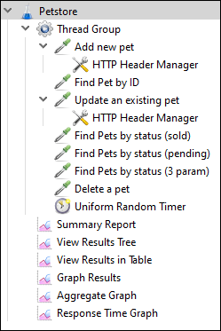  
<small>[🔙 Go back](#jmeter)</small>

 Set Thread Group properties (1 user):  
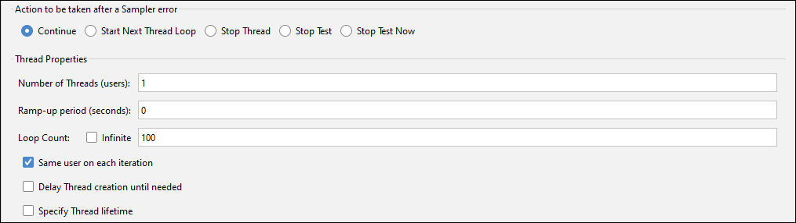  
<small>[🔙 Go back](#jmeter)</small>

 Summary report:  
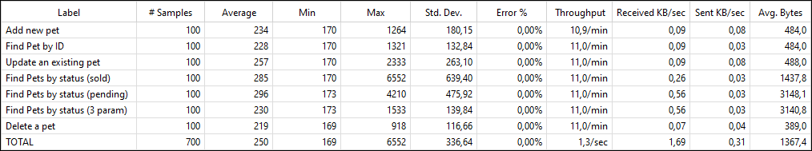  
<small>[🔙 Go back](#jmeter)</small>

 Aggregate graph - time of requests:  
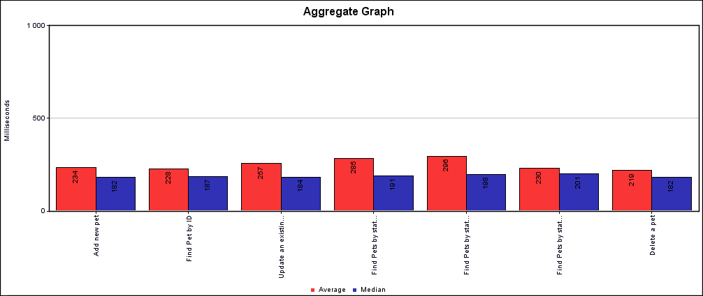  
<small>[🔙 Go back](#jmeter)</small>

 Let's run some load tests. I left only one request:  
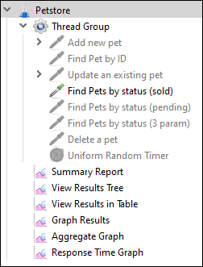  
<small>[🔙 Go back](#jmeter)</small>

 Set Thread Group properties (5 users, 100 iterations):  
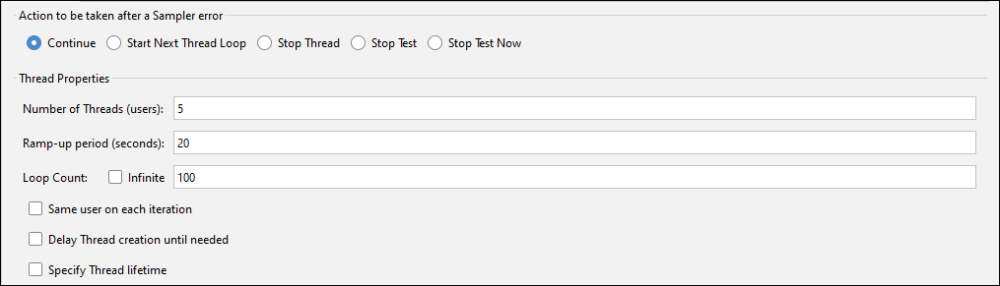  
<small>[🔙 Go back](#jmeter)</small>

 Summary report:  
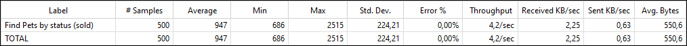  
<small>[🔙 Go back](#jmeter)</small>

 Graph results:  
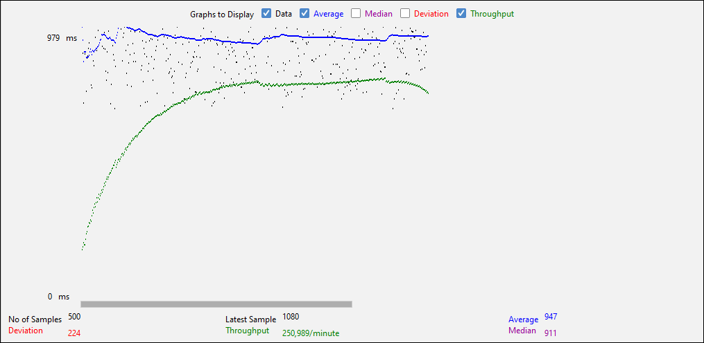  
No problems with that.  
<small>[🔙 Go back](#jmeter)</small>

 Let's add some users. Petstore, sorry, I'll do it quickly.  
Set Thread Group properties (100 users, 15 iterations):  
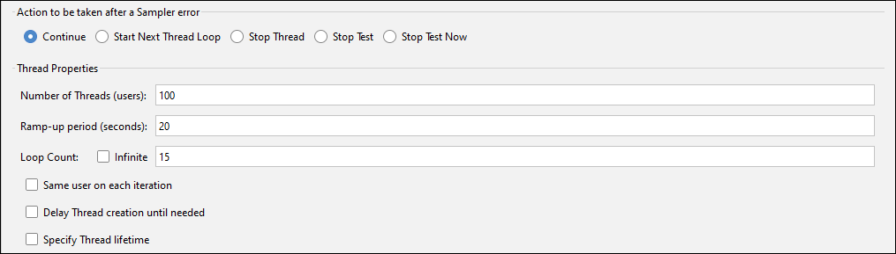  
<small>[🔙 Go back](#jmeter)</small>

 Summary report:  
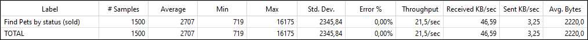  
<small>[🔙 Go back](#jmeter)</small>

 Graph results:  
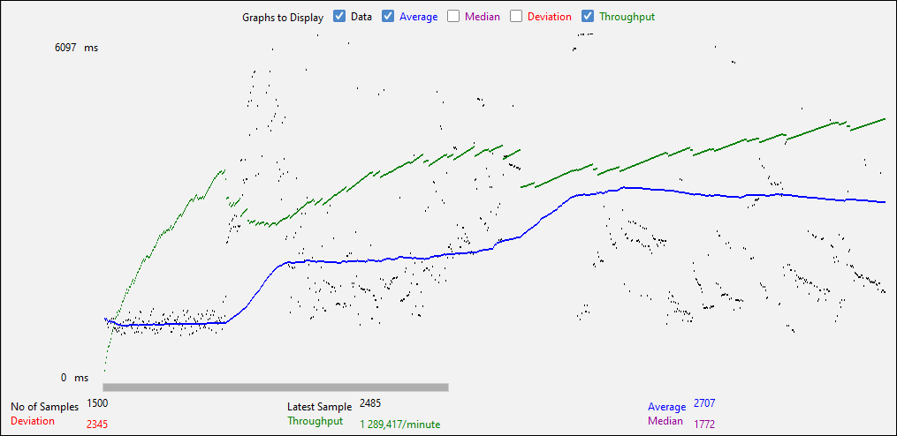  

With a hundred users, Petstore had some difficulties with request processing.

[⬆️ Go to top](#start)
