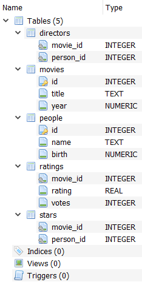
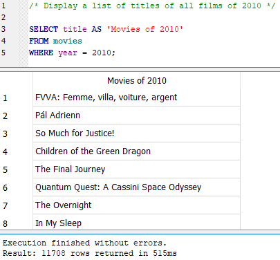
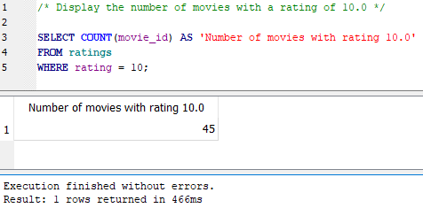
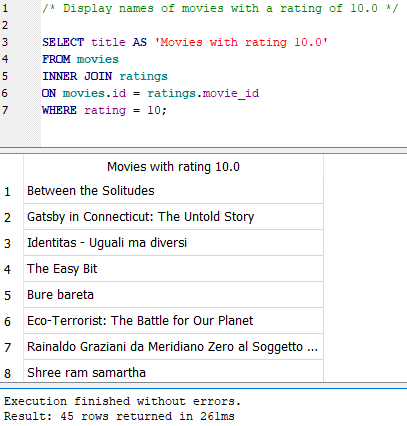
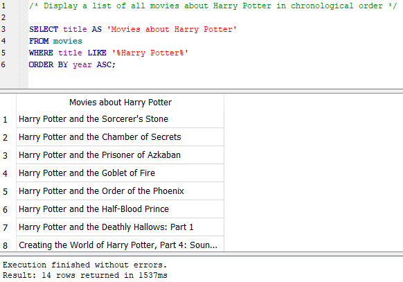
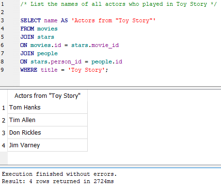
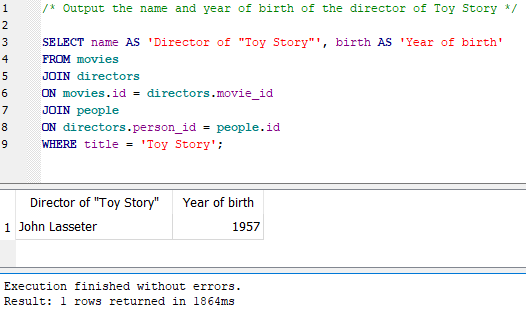
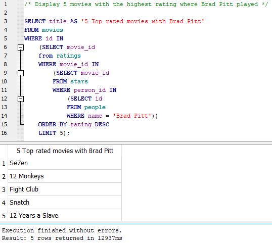
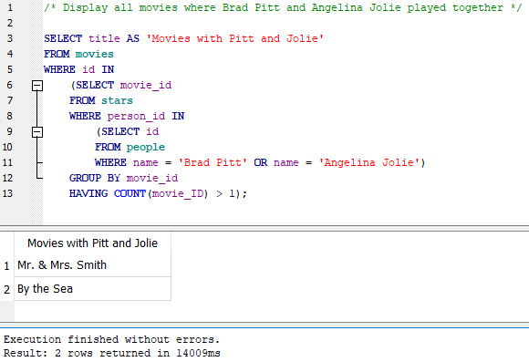

# Building queries to SQL database <a name="start"></a>

For making this task I used DB Browser for SQLite

## DB Schema



## Queries (with output result) <a name="queries"></a>

- [1. Display a list of titles of all films of 2010](#sql1)
- [2. Display the year of birth of the actress Emma Stone](#sql2)
- [3. List all movies released in or after 2018 in alphabetical order](#sql3)
- [4. Display the number of movies with a rating of 10.0](#sql4)
- [5. Display titles of movies with a rating of 10.0](#sql5)
- [6. Display a list of all movies about Harry Potter in chronological order](#sql6)
- [7. Display the average rating of all films of 2012](#sql7)
- [8. List the names of all actors who played in Toy Story](#sql8)
- [9. Output the name and year of birth of the director of Toy Story](#sql9)
- [10. Display 5 movies with the highest rating where Brad Pitt played](#sql10)
- [11. Display all movies where Brad Pitt and Angelina Jolie played together](#sql11)

### 1. Display a list of titles of all films of 2010 <a name="sql1"></a>

```
SELECT title AS 'Movies of 2010'
FROM movies
WHERE year = 2010;
```
<small>[Go back](#queries)</small>

### 2. Display the year of birth of the actress Emma Stone <a name="sql2"></a>

```
SELECT birth AS 'Emma Stone''s year of birth'
FROM people
WHERE name = 'Emma Stone';
```
<small>[Go back](#queries)</small>

### 3. List all movies released in or after 2018 in alphabetical order <a name="sql3"></a>

```
SELECT title AS 'Movies of 2018 and later'
FROM movies
WHERE year >= 2018
ORDER BY title ASC;
```
<small>[Go back](#queries)</small>

### 4. Display the number of movies with a rating of 10.0 <a name="sql4"></a>

```
SELECT COUNT(movie_id) AS 'Number of movies with rating 10.0'
FROM ratings
WHERE rating = 10;
```
<small>[Go back](#queries)</small>

### 5. Display titles of movies with a rating of 10.0 <a name="sql5"></a>

```
SELECT title AS 'Movies with rating 10.0'
FROM movies
INNER JOIN ratings 
ON movies.id = ratings.movie_id
WHERE rating = 10;
```
<small>[Go back](#queries)</small>

### 6. Display a list of all movies about Harry Potter in chronological order <a name="sql6"></a>

```
SELECT title AS 'Movies about Harry Potter'
FROM movies
WHERE title LIKE '%Harry Potter%'
ORDER BY year ASC;
```
<small>[Go back](#queries)</small>

### 7. Display the average rating of all films of 2012 <a name="sql7"></a>

```
SELECT AVG (rating) AS 'Average rating of 2012'
FROM ratings
JOIN movies
ON ratings.movie_id = movies.id
WHERE year = 2012;
```
<small>[Go back](#queries)</small>

### 8. List the names of all actors who played in Toy Story <a name="sql8"></a>

```
SELECT name AS 'Actors from "Toy Story"'
FROM movies
JOIN stars
ON movies.id = stars.movie_id
JOIN people
ON stars.person_id = people.id
WHERE title = 'Toy Story';
```
<small>[Go back](#queries)</small>

### 9. Output the name and year of birth of the director of Toy Story <a name="sql9"></a>

```
SELECT name AS 'Director of "Toy Story"', birth AS 'Year of birth'
FROM movies
JOIN directors
ON movies.id = directors.movie_id
JOIN people
ON directors.person_id = people.id
WHERE title = 'Toy Story';
```
<small>[Go back](#queries)</small>

### 10. Display 5 movies with the highest rating where Brad Pitt played <a name="sql10"></a>

```
SELECT title AS '5 Top rated movies with Brad Pitt'
FROM movies
WHERE id IN 
  (SELECT movie_id
  from ratings
  WHERE movie_id IN
    (SELECT movie_id
    FROM stars
    WHERE person_id IN
      (SELECT id
      FROM people
      WHERE name = 'Brad Pitt'))
  ORDER BY rating DESC
  LIMIT 5);
```
<small>[Go back](#queries)</small>

### 11. Display all movies where Brad Pitt and Angelina Jolie played together <a name="sql11"></a>

```
SELECT title AS 'Movies with Pitt and Jolie'
FROM movies
WHERE id IN
  (SELECT movie_id
  FROM stars
  WHERE person_id IN 
    (SELECT id
    FROM people
    WHERE name = 'Brad Pitt' OR name = 'Angelina Jolie')
  GROUP BY movie_id
  HAVING COUNT(movie_ID) > 1);
```
<small>[Go back](#queries)</small>
