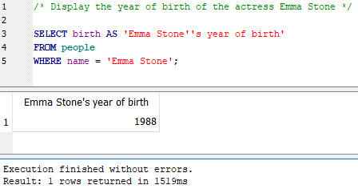
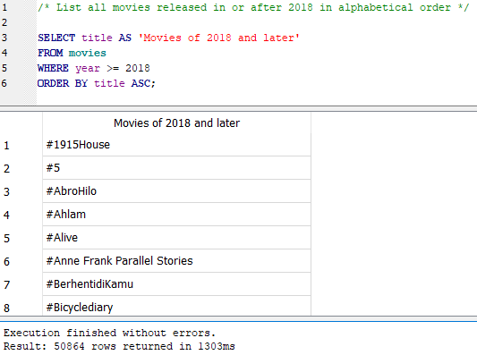
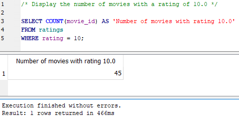
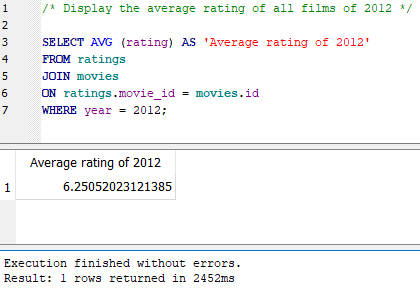
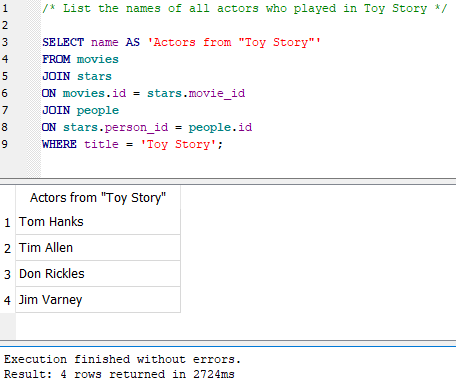
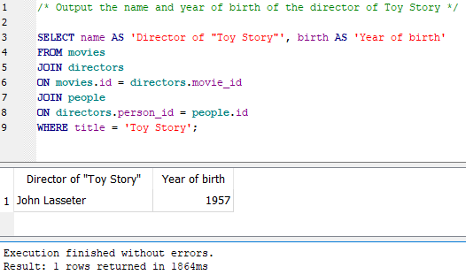
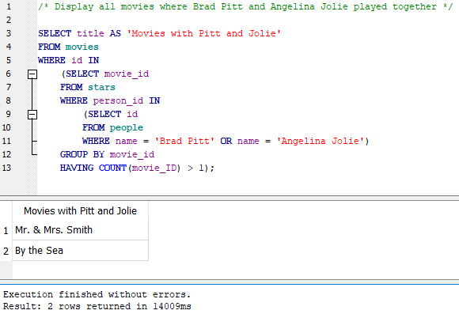

# Building queries to SQL database

For making this task I used DB Browser for SQLite

## DB Schema

## Queries (with output result)

1. Display a list of titles of all films of 2010  

2. Display the year of birth of the actress Emma Stone  

3. List all movies released in or after 2018 in alphabetical order  

4. Display the number of movies with a rating of 10.0  

5. Display names of movies with a rating of 10.0  

6. Display a list of all movies about Harry Potter in chronological order  

7. Display the average rating of all films of 2012  

8. List the names of all actors who played in Toy Story  

9. Output the name and year of birth of the director of Toy Story  

10. Display 5 movies with the highest rating where Brad Pitt played  

11. Display all movies where Brad Pitt and Angelina Jolie played together  

