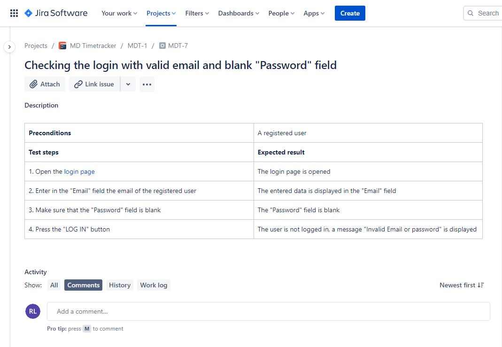

# Testing Web Application 

## Table of Contents

- [About](#about)
- [Main Task](#main_task)  
- [Checklist](#checklist)  
- [Test Cases](#test_cases)  
- [Bug Reports](#bug_reports)  

## About 

**Testing Login form and Password recovery form of Web Application**  

• Compiling checklists, test cases  
• Performing tests  
• Compiling bug reports based on the found bugs  
• Working in the Atlassian Jira work management system  

## Main task 

<small>[Go back](#queries)</small>

## Checklist 

<small>[Go back](#queries)</small>

## Test Cases 

<small>[Go back](#queries)</small>

<small>[Go back](#queries)</small>

<small>[Go back](#queries)</small>

<small>[Go back](#queries)</small>

<small>[Go back](#queries)</small>

<small>[Go back](#queries)</small>

<small>[Go back](#queries)</small>

<small>[Go back](#queries)</small>

<small>[Go back](#queries)</small>

<small>[Go back](#queries)</small>

<small>[Go back](#queries)</small>

<small>[Go back](#queries)</small>

## Bug Reports 

<small>[Go back](#queries)</small>

<small>[Go back](#queries)</small>

<small>[Go back](#queries)</small>

<small>[Go back](#queries)</small>

<small>[Go back](#queries)</small>
